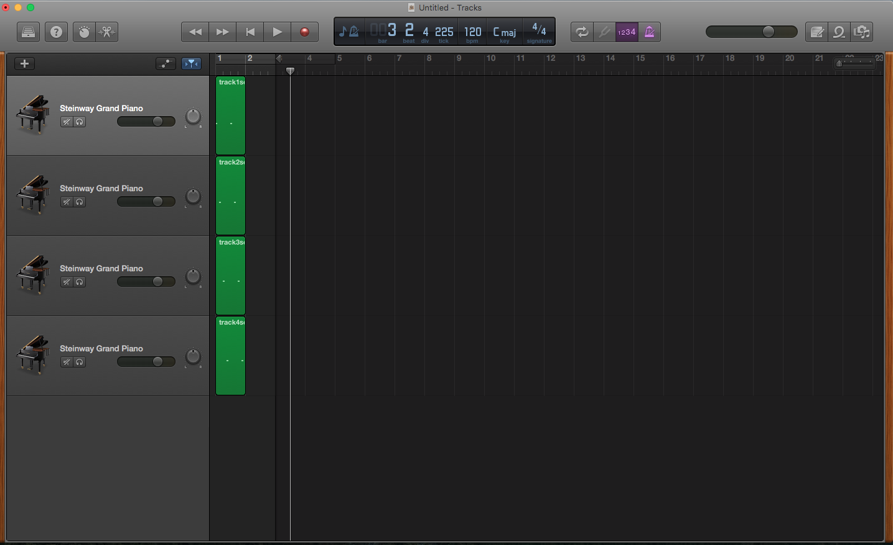

# Simple Sequences

Sequences are a powerful feature in AudioKit. `AKSequencer` lets you define musical events through an imported MIDI file, and use audio samples as the source material for the sequence

The MIDI file used in this example consists of 4 piano tracks. If you open the file in GarageBand, 
this is what you will see:

The MIDI file you use is how the Sequencer knows what notes to play. Think of what you're doing as
writing the score that the Sequencer will play, and you define what instrument you want to play
the parts of the score using AudioKit. 

If you're wanting to start your own project using Sequences from scratch, here's what you'll need to
do:

1) Make a MIDI file in GarageBand, Logic, or other DAW or Sequencer of your choice. 

2) Add tracks for each instrument or voice that you will need

3) Develop each track with whatever instruments you want, knowing that those instruments will be replaced in AudioKit, and add the notes you want to use for each track. 

This example shows how sequences can be played-back, but there is quite a lot to explore beyond this 
example (such as changing tempo, adding pre-roll, rewinding, etc), so I highly encourage you to read 
the [documentation](http://audiokit.io/docs/Classes/AKSequencer.html) and check out the Sequencer 
playgrounds:

[Sequencer Single Output](http://audiokit.io/playgrounds/Sequencer%20-%20Single%20output/)
[Sequencer Multiple Output](http://audiokit.io/playgrounds/Sequencer%20-%20Multiple%20output/)

NOTE 1: When running this example, you will probably see an error log in the console that says 
something along the lines of "ERROR:    912: Invalid beat range or track is empty". This is normal, 
and is coming from deep within Apple Core Audio - level code. 

NOTE2 : AudioKit Sequences are under active development. Please, if you find a bug at all, let us
know on [GitHub Issues](https://github.com/audiokit/AudioKit/issues). If you have any questions 
at all, please feel free to post on the [AudioKit Google Group](https://groups.google.com/forum/#!forum/audiokit).