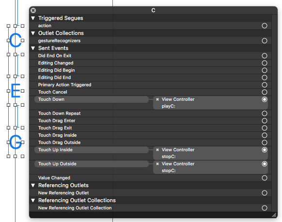

# AKFMSynthInstrument

This is example is intended as a stepping-off point for students wanting to learn how the AudioKit 
[AnalogSynthX app](http://audiokit.io/gallery/) operates. 

Specifically, we're moving on from audio file play-back, looping, mixing, effects such as reverb, 
and sequencing, to showing how you can use some of AudioKit's existing [Instrument classes](http://audiokit.io/docs/Instruments.html) to build a synthesizer app
of your own. These instruments are wrappers around various AudioKit synthesizers and generators.

This example uses the [AKFMSynth class](http://audiokit.io/docs/Instruments.html#/s:C8AudioKit9AKFMSynth). `AKFMSynth` is a wrapper class
around `AKFMOscillator`(http://audiokit.io/docs/Classes/AKFMOscillator.html) that allows you to 
create multiple "voices" of an `FMOscillator`, making it playable as a polyphonic instrument. 

Just like the `AKFMOscillator` that it encapsulates, you can control the following parameters:

* modulatingMultiplier
* modulationIndex
* attackDuration
* decayDuration
* sustainLevel
* releaseDuration

If you're not familiar with the concept of voices in a synthesizer, they're essentially the number 
of oscillators you have at your disposal.So, if we gave our `fmSynth` three voices (as we do in this 
example), we'd be able to control three oscillators:

```
fmSynth = AKFMSynth(voiceCount: 3)
```

Instead of turning an oscillator on and off, think of what we're doing as playing a note and 
stopping a note. For this app, we'll give our synthesizer the ability to play three notes: C, E, and
G. We'll have three separate functions for each note. The `playC` function below, will call 
`AKFMSynth`'s `playNote` function. We specify that we want to pass in a value of 48 (which is the 
MIDI note value for C at the fourth octave), and a velocity value of 50.

```
public func playC() {
    fmSynth.playNote(48, velocity: 50)
}
```

In order to call `playC`, we'll follow the pattern of calling the function when we press a 
`UIButton`. In `ViewController.swift`, you'll see a function below:

```
@IBAction func playC(sender: AnyObject)
```

This is called whenever we press the "C" button on our interface. 

To stop playing our note, we'll have a corresponding `stopC` function: 

```
public func stopC() {
	fmSynth.stopNote(48)
}
```

This will be called whenever we take our finger off of our button. It's important to note that there
are two cases we need to account for here --- if we're taking our finger directly off of the button 
after pressing it, or, if we press our button, move our finger to a different point on the screen, 
and THEN take our finger off of the screen. 

For the first case, we use `UIButton`'s `Touch Up Inside` event. For the second, we'll use the 
`Touch Up Outside` event. To access these events, right click on the button in the `Storyboard` 
file, and you'll see the screenshot below:



You can see that both the `Touch Up Inside` and `Touch Up Outside` events are connect to our `stopC` 
function. You should also note that the `Touch Down` event is connected to `Play C`. 

## Editing Sounds

Now that you have an understanding on how `AKFMSynth` encapsulates `AKFMOscillator` to be a 
playable, polyphonic instrument, try changing the sounds to be something that you would imagine 
performing or composing with. If you haven't used Playgrounds yet, here's a good chance to explore 
them. Since `AKFMSynth` is a wrapper for `AKFMOscillator`, you can get an idea of what sounds are
possible by going to the [AKFMOscillator playground](http://audiokit.io/playgrounds/FM%20Oscillator/)
(the link is a video of that particular playground in action). 

We've included five presets in that Playground to explore: 

* Stun Ray
* Wobble
* Fog Horn
* Buzzer
* Spiral
* Randomize 

I'd encourage you to explore these presets, experiment with different values to get the sounds you 
like, and use those in your polyphonic `AKFMSynth` app!
